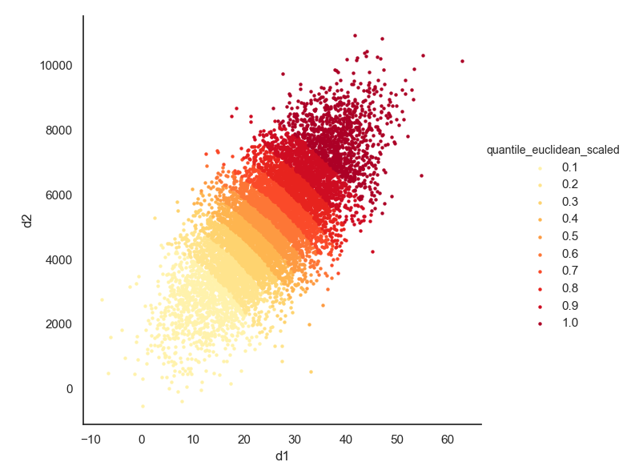

##  Calculate quantiles of multidimensional samples without estimating the distribution of the population

### References:

- [Pandas' `qcut`](https://pandas.pydata.org/pandas-docs/stable/reference/api/pandas.qcut.html)
- [Mahalanobis Distance on Wikipedia](https://en.wikipedia.org/wiki/Mahalanobis_distance)
- [Mahalonobis Distance – Understanding the math with examples (python)](https://www.machinelearningplus.com/statistics/mahalanobis-distance/)